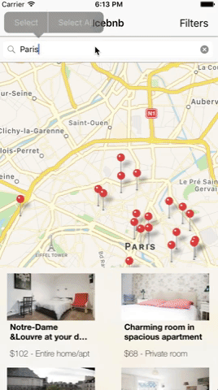

# InstantSearch iOS: Examples
>Example apps built with [algolia/instantsearch-ios](https://github.com/algolia/instantsearch-ios).

**InstantSearch iOS** is a library providing widgets and helpers to help you build the best instant-search experience on iOS with Algolia. It is built on top of Algolia's [Swift API Client](https://github.com/algolia/algoliasearch-client-swift) to provide you a high-level solution to quickly build various search interfaces.

## Examples
We have built a demo application to give you an idea of what you can build with InstantSearch iOS:

## [E-commerce Ikea App](https://github.com/algolia/instantsearch-ios-examples/tree/master/ecommerce%20Ikea)

This example imitates a product search interface like well-known e-commerce applications.

- Search in the **product's name**, **type**, and **category**
- Filter with RefinementList by **type** or **category**
- Filter with Numeric filters by **price** or **rating**
- Custom views using `AlgoliaWidget` for filtering by **price** and **rating**.

 
 
 
 
 
 
 
 
 
 
 
 

## [Tourism application](https://github.com/algolia/instantsearch-ios-examples/tree/master/Icebnb)

Example of a bed and breakfast search interface.

- Search in a place by **location**
- Filter with RefinementList by **room_type**
- Filter with Numeric filters by **price**
- Custom views using `AlgoliaWidget` for filtering by **price** and **room_type**
- Custom widgets for linking the search results with the `MKMapView`

