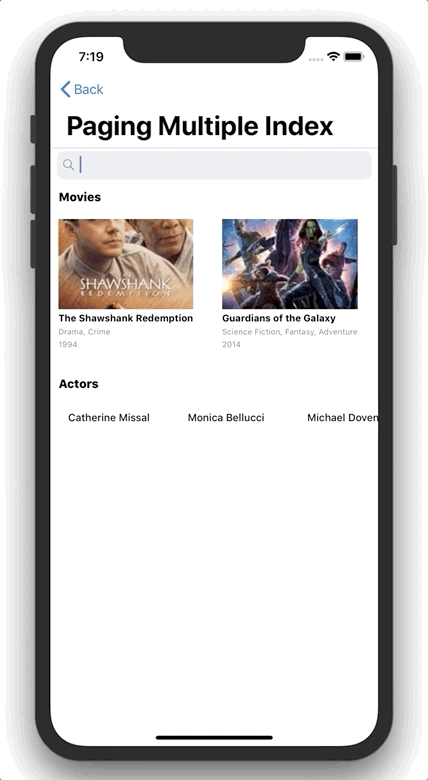
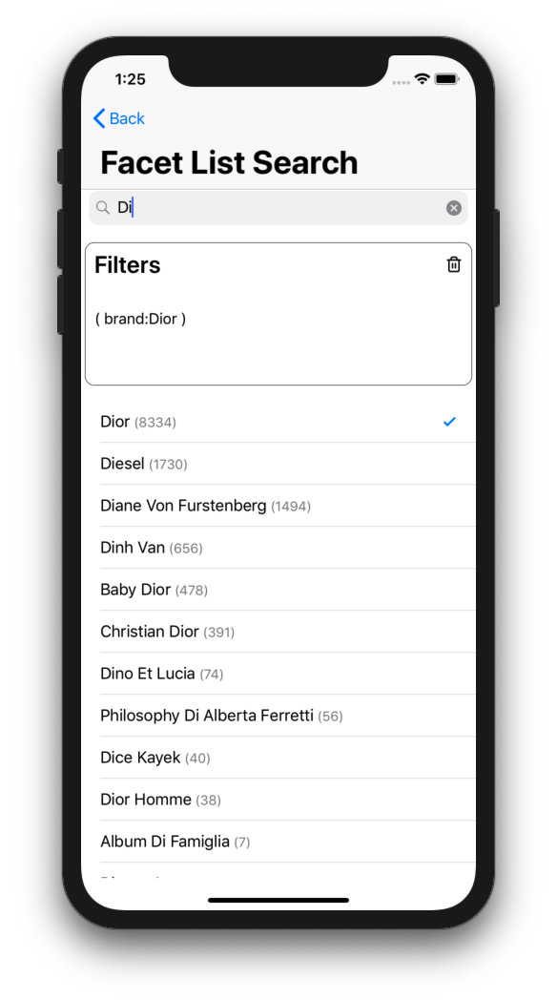

# InstantSearch iOS: Examples
>Example of search experience components built with [algolia/instantsearch-ios](https://github.com/algolia/instantsearch-ios).

**InstantSearch iOS** is a library providing components and helpers to help you build the best instant-search experience on iOS with Algolia. It is built on top of Algolia's [Swift API Client](https://github.com/algolia/algoliasearch-client-swift) to provide you a high-level solution to quickly build various search interfaces.

## Examples
We have built a demo application to give you an idea of what you can build with InstantSearch iOS:

## Search as you type experience

- Search results updated on each keystroke

 
 
 
 
 
 
 
 
 
 
 
 
 
 
 
 
 
 
 

## Single index search

- Search as you type experience
- Search a movie by title, actor or year
- Infinite scrolling of search results

 
 
 
 
 
 
 
 
 
 
 
 
 
 
 
 
 
 
 

## Multi index search

Example of a multi-index search interface.

- Multi-Index table showcasing results from different indices (movies and actors)
- Uses the same index for movies as single index example, but presents results differently (horizontal scrolling)
- Independent infinite scrolling for both hits views

 
 
 
 
 
 
 
 
 
 
 
 
 
 
 

## Search for facets

Example of a facet search interface.

- Search as you type experience
- Presentation of selected facets

 
 
 
 
 
 
 
 
 
 
 
 
 
 
 
 
 
 

## Sorting results

Example of sorting movies by year attribute.

 
 
 
 
 
 
 
 
 
 
 
 
 
 
 
 
 
 
 
 
 

## Query Suggestions

Example of updating list of relevant queries that your users can select from as they type.

 
 
 
 
 
 
 
 
 
 
 
 
 
 
 
 